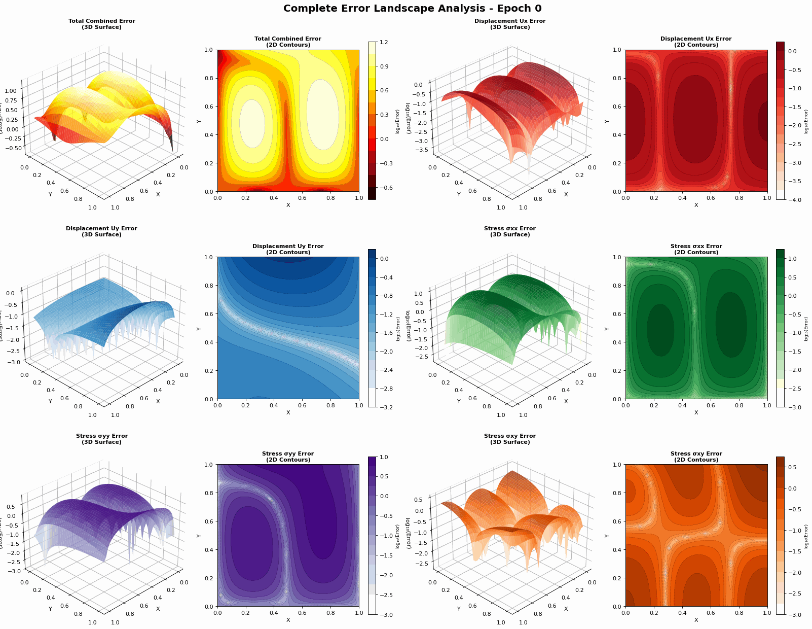

# PINN Experiments with Residual Tracking

This directory contains experiment scripts to test different training configurations for the Physics-Informed Neural Network (PINN) solving linear elasticity problems.

## 🎬 Visualizations

Watch the neural network learn to solve elasticity equations in real-time:

<div align="center">

### Error Evolution During Training

*How prediction errors in displacement components (Ux, Uy) decrease as the network trains*

### Weight Evolution

*Neural network weights evolving through parameter space during training*

### Weight Bread Slices

*Cross-sectional view of weight distributions across network layers*

### Physics Equation Discovery

*How the network learns to satisfy the PDE, constitutive, and boundary conditions*

</div>

---

## Quick Start

### 1. Run Baseline with Residual Tracking
```bash
python pinn_pytorch_with_residual_tracking.py
```
This creates detailed residual plots and saves the trained model.

### 2. Run L2 Regularization Experiments
```bash
cd experiment_l2_regularization
python experiment_l2_regularization.py
```
Tests different L2 regularization values: `[0.0, 1e-6, 1e-5, 1e-4, 1e-3]`

**Outputs:**
- `model_[experiment_name].pt` - Trained model checkpoints
- `residuals_[experiment_name].npy` - Detailed residual tracking data
- `l2_regularization_comparison.png` - Loss comparison plots

### 3. Run Learning Rate Scheduling Experiments
```bash
cd experiment_lr_scheduling
python experiment_lr_scheduling.py
```
Tests different LR schedules: constant, manual, step, exponential, cosine, cosine with warm restarts, reduce on plateau

**Outputs:**
- `model_[schedule_name].pt` - Trained model checkpoints
- `residuals_[schedule_name].npy` - Detailed residual tracking data
- `lr_scheduling_comparison.png` - Loss and LR schedule comparison plots

### 4. Compare Results Across All Experiments
```bash
python compare_residuals.py
```

This script:
- Loads all `residuals_*.npy` files from experiment directories
- Creates comprehensive comparison plots
- Prints summary tables showing which approach performs best
- Analyzes convergence behavior

**Outputs:**
- `comparison_main_components.png` - Main loss component comparison
- `comparison_pde_components.png` - PDE residual comparison
- `comparison_constitutive.png` - Constitutive equation comparison
- `comparison_final_values.png` - Bar chart of final values
- Terminal output with detailed analysis

## Residual Data Structure

Each `.npy` file contains:
```python
{
    'epochs': np.array([0, 10, 20, ...]),
    'residuals': {
        'total_loss': [...],
        'pde_loss': [...],
        'constitutive_loss': [...],
        'boundary_u_loss': [...],
        'boundary_s_loss': [...],
        'pde_x': [...],          # PDE X equation residual
        'pde_y': [...],          # PDE Y equation residual
        'const_xx': [...],       # σₓₓ constitutive residual
        'const_yy': [...],       # σᵧᵧ constitutive residual
        'const_xy': [...],       # σₓᵧ constitutive residual
        'bc_ux_up': [...],       # Boundary conditions (8 components)
        'bc_ux_lo': [...],
        'bc_uy_lo': [...],
        'bc_uy_ri': [...],
        'bc_uy_le': [...],
        'bc_sxx_ri': [...],
        'bc_sxx_le': [...],
        'bc_syy_up': [...]
    },
    'experiment_name': 'baseline',
    'training_time': 123.45,
    # Experiment-specific metadata
}
```

## Customizing Experiments

### Add New L2 Values
Edit `experiment_l2_regularization.py`:
```python
l2_lambdas = [0.0, 1e-6, 1e-5, 1e-4, 1e-3, 1e-2]  # Add more values
experiment_names = ['baseline', 'l2_1e-6', ..., 'l2_1e-2']
```

### Add New LR Schedules
Edit `experiment_lr_scheduling.py`:
```python
schedules['my_schedule'] = {
    'type': 'step',  # or 'exponential', 'cosine', etc.
    'params': {'initial_lr': 1e-2, 'step_size': 500, 'gamma': 0.5},
    'name': 'my_custom_schedule'
}
```

### Change Number of Epochs
Both experiment scripts default to 5000 epochs. Change:
```python
run_l2_experiment(l2_lambda, exp_name, num_epochs=10000)  # More epochs
```

## Analysis Tips

1. **Check convergence**: Look at when losses plateau
2. **Compare physics satisfaction**: Lower PDE/constitutive residuals = better physics
3. **Balance**: Best total loss doesn't always mean best physics understanding
4. **Boundary conditions**: Should converge faster than interior physics
5. **Training time**: Consider efficiency vs accuracy tradeoffs

## Physics Equations Tracked

**PDE (Momentum Balance):**
- X: ∂σₓₓ/∂x + ∂σₓᵧ/∂y = fₓ
- Y: ∂σₓᵧ/∂x + ∂σᵧᵧ/∂y = fᵧ

**Constitutive (Stress-Strain Relations):**
- σₓₓ = (λ+2μ)εₓₓ + λεᵧᵧ
- σᵧᵧ = (λ+2μ)εᵧᵧ + λεₓₓ
- σₓᵧ = 2μεₓᵧ

**Boundary Conditions:**
- Displacement BCs: Uₓ=0, Uᵧ=0 on various boundaries
- Stress BCs: σₓₓ=0, σᵧᵧ=prescribed on various boundaries

## Loading Saved Data

```python
import numpy as np

# Load residual data
data = np.load('residuals_baseline.npy', allow_pickle=True).item()

# Access specific residuals
epochs = data['epochs']
total_loss = data['residuals']['total_loss']
pde_x = data['residuals']['pde_x']

# Load model
import torch
model = PINN()
model.load_state_dict(torch.load('model_baseline.pt'))
```
